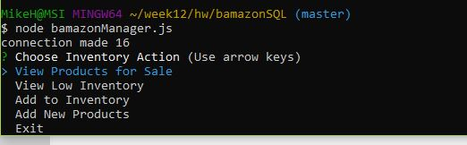
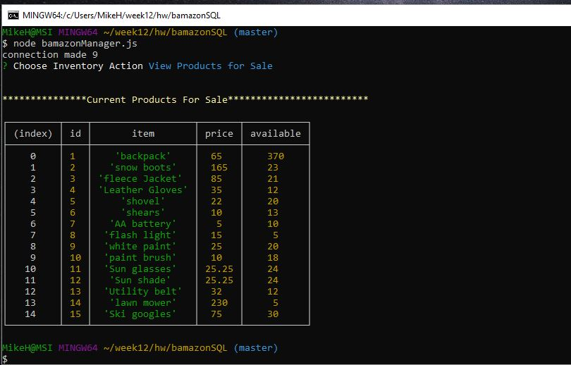
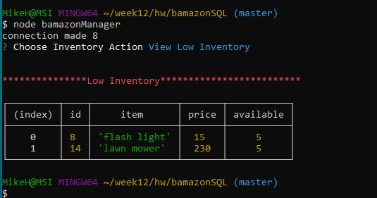
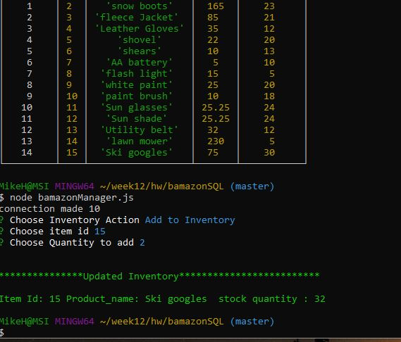
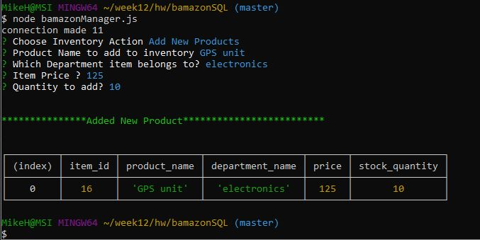

# bamazonSQL

**BamazonSQL** is a command line application demonstrating  **node.js** node packages to query **MySQL** database called *bamazon* with one table *products*. 

Also, used in this application is *mysql* stored procedures which are called to execute sql commands and return back results.

The following *npms* are used in this application:
+ **mysql**
+ **cli-color** (console font color)
+ **inquirer** (interactive command line)

**BamazonSQL** has two javascript node files: 
*customer*  and *manager* each connecting to the same *bamazon* database.

# bamazonCustomer

When the user starts the *bamazonCustomer.js* the first call is to show all products for sale. Which is rendered by executing stored procedure *allproducts* . 

 

 An *inquirer* prompt asks the user to choose **product** id and **quantity** to order. 
 stored procedure *productOrder is called to check if inventory is sufficient . If inventory is sufficient it will subtract the inventory by the qty ordered and calculate cost by  *quantity* and *price* which is returned to the console the *total cost*. 

 .

If the customer order quantity is greater than what is available, the application will return 
**Insufficient Available Quantity** . 

# bamazonManager
When the user starts the *bamazonManager.js* , the console displays inquirer choice menu for inventory action.  

.

The first item on the menu *View Products for Sale*. Which calls the same Mysql stored procedure used in *bamazonCustomer*. 

.

The second menu choice is *View Low Inventory* which calls the same stored procedure used in *View Products for Sale* . A parameter value is sent to the stored procedure call used in the procedure logic to show products with inventory available  of less than 6 . 

.

The third menu choice is *Add to Inventory* requiring the user to enter item id and the quantity to add. 

 . A stored procedure takes  input parameters the **product id** and **quantity** updating the record for the product with new quantity and returning back the result showing the updated inventory. 

 The final menu option is the *Add New Products* . The user will be prompted to enter **Product Name**, **Department**, **Price** , and **Quantity**. 

 .