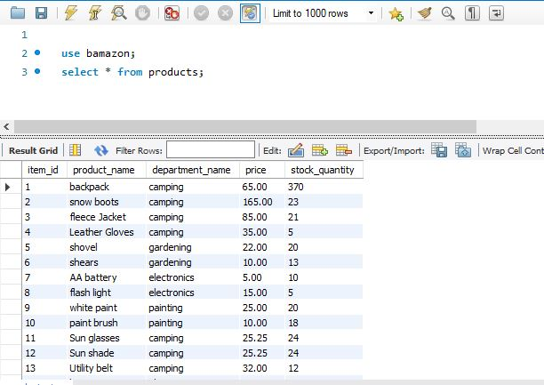
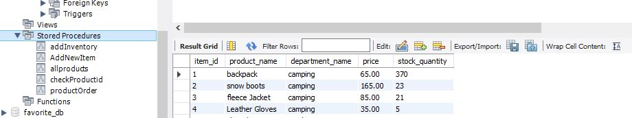
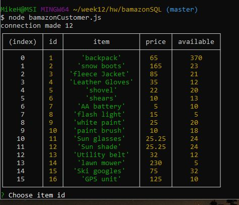
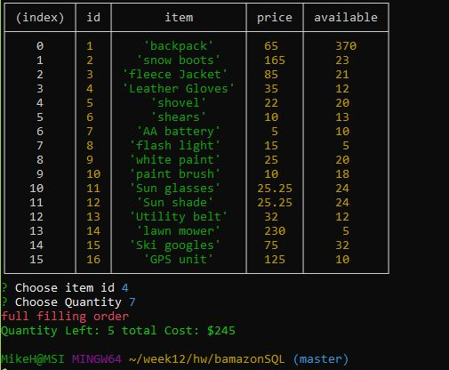
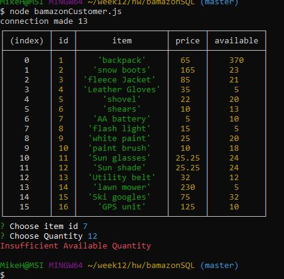

# bamazonSQL

**BamazonSQL** is a command line application demonstrating  **node.js** node packages to query **MySQL** database called *bamazon* with one table *products*. 

Also, used in this application is *mysql* stored procedures which are called to execute sql commands and return back results.

The following *npms* are used in this application:
+ **mysql**
+ **cli-color** (console font color)
+ **inquirer** (interactive command line)

**BamazonSQL** has two javascript node files: 
*customer*  and *manager* each connecting to the same *bamazon* database.

# bamazonCustomer

When the user starts the *bamazonCustomer.js* the first call is to show all products for sale. Which rendered by executing stored procedure *allproducts* . 

 

 An *inquirer* prompt asks the user to choose **product** id and **quantity** to order. 
 stored procedure *productOrder is called to check if inventory is sufficient . If inventory is sufficient it will subtract the inventory by the qty ordered and calculate cost by  *quantity* and *price* which is returned to the console the *total cost*. 

 .

If the customer order quantity is greater than what is available, the application will return 
**Insufficient Available Quantity** . 

